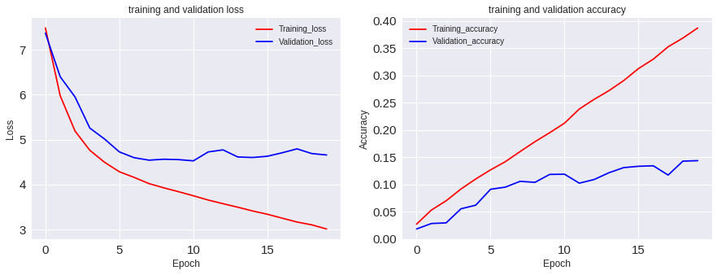

```python
#Libraries 
#!pip install imageio
import sys
import os
import tarfile
import shutil
import numpy as np
import pandas as pd
import matplotlib.pyplot as plt
from matplotlib.pyplot import imshow
from keras import regularizers
from keras.models import Sequential
from keras.layers import Dropout, Activation, Dense
from keras.layers.normalization import BatchNormalization
from keras.layers import Convolution2D,MaxPooling2D , Flatten


```


```python
from google.colab import drive
drive.mount('/content/gdrive')
```


    Go to this URL in a browser: https://accounts.google.com/o/oauth2/auth?client_id=947318989803-6bn6qk8qdgf4n4g3pfee6491hc0brc4i.apps.googleusercontent.com&redirect_uri=urn%3Aietf%3Awg%3Aoauth%3A2.0%3Aoob&scope=email%20https%3A%2F%2Fwww.googleapis.com%2Fauth%2Fdocs.test%20https%3A%2F%2Fwww.googleapis.com%2Fauth%2Fdrive%20https%3A%2F%2Fwww.googleapis.com%2Fauth%2Fdrive.photos.readonly%20https%3A%2F%2Fwww.googleapis.com%2Fauth%2Fpeopleapi.readonly&response_type=code
    
    Enter your authorization code:
    ··········
    Mounted at /content/gdrive


```python
xtrain=np.load('gdrive/My Drive/Colab Notebooks/X_train_64.npy')
xtest=np.load('gdrive/My Drive/Colab Notebooks/X_test_64.npy')
ytrain=np.load('gdrive/My Drive/Colab Notebooks/y_train_64.npy')
ytest=np.load('gdrive/My Drive/Colab Notebooks/y_test_64.npy')
```


```python
#create model
model = Sequential()

# Convolution layer 1
model.add(Convolution2D(filters = 16, kernel_size = (2,2),padding = 'Same', 
                         activation ='relu', kernel_regularizer=regularizers.l2(0.01),
                        input_shape = (64, 64, 3))) 
model.add(BatchNormalization())
model.add(MaxPooling2D(pool_size=(2,2)))
model.add(Dropout(0.2))

# Convolution layer 2
model.add(Convolution2D (filters = 32, kernel_size = (2,2),padding = 'Same', 
                         activation ='relu',kernel_regularizer=regularizers.l2(0.01))) 
model.add(BatchNormalization())
model.add(MaxPooling2D(pool_size=(2,2)))
model.add(Dropout(0.2))

# Convolution layer 3
model.add(Convolution2D (filters = 64, kernel_size = (2,2),padding = 'Same', 
                         activation ='relu',kernel_regularizer=regularizers.l2(0.01))) 
model.add(BatchNormalization())
model.add(MaxPooling2D(pool_size=(2,2)))
model.add(Dropout(0.2))

# Convolution layer 4
model.add(Convolution2D (filters = 128, kernel_size = (2,2),padding = 'Same', 
                         activation ='relu',kernel_regularizer=regularizers.l2(0.01))) 
model.add(BatchNormalization())
model.add(MaxPooling2D(pool_size=(2,2)))
model.add(Dropout(0.2))

# Convolution layer 5
model.add(Convolution2D (filters = 256, kernel_size = (2,2),padding = 'Same', 
                         activation ='relu',kernel_regularizer=regularizers.l2(0.01))) 
model.add(BatchNormalization())
model.add(MaxPooling2D(pool_size=(2,2)))
model.add(Dropout(0.2))


# Flatten
model.add(Flatten()) 

# Fully connected layer 
model.add(Dense(units = 1000)) 
model.add(BatchNormalization())
model.add(Activation('relu')) 
model.add(Dropout(0.2))

#Output layer with 120 nodes
model.add(Dense(120, activation = 'softmax')) 
# Compile model

model.compile(loss='categorical_crossentropy',optimizer='adam', metrics=['accuracy'])
print(model.summary())
model_history = model.fit(xtrain, ytrain, epochs=20, batch_size=64,validation_split=0.2)
```


    _________________________________________________________________
    Layer (type)                 Output Shape              Param #   
    =================================================================
    conv2d_5 (Conv2D)            (None, 64, 64, 16)        208       
    _________________________________________________________________
    batch_normalization_6 (Batch (None, 64, 64, 16)        64        
    _________________________________________________________________
    max_pooling2d_5 (MaxPooling2 (None, 32, 32, 16)        0         
    _________________________________________________________________
    dropout_6 (Dropout)          (None, 32, 32, 16)        0         
    _________________________________________________________________
    conv2d_6 (Conv2D)            (None, 32, 32, 32)        2080      
    _________________________________________________________________
    batch_normalization_7 (Batch (None, 32, 32, 32)        128       
    _________________________________________________________________
    max_pooling2d_6 (MaxPooling2 (None, 16, 16, 32)        0         
    _________________________________________________________________
    dropout_7 (Dropout)          (None, 16, 16, 32)        0         
    _________________________________________________________________
    conv2d_7 (Conv2D)            (None, 16, 16, 64)        8256      
    _________________________________________________________________
    batch_normalization_8 (Batch (None, 16, 16, 64)        256       
    _________________________________________________________________
    max_pooling2d_7 (MaxPooling2 (None, 8, 8, 64)          0         
    _________________________________________________________________
    dropout_8 (Dropout)          (None, 8, 8, 64)          0         
    _________________________________________________________________
    conv2d_8 (Conv2D)            (None, 8, 8, 128)         32896     
    _________________________________________________________________
    batch_normalization_9 (Batch (None, 8, 8, 128)         512       
    _________________________________________________________________
    max_pooling2d_8 (MaxPooling2 (None, 4, 4, 128)         0         
    _________________________________________________________________
    dropout_9 (Dropout)          (None, 4, 4, 128)         0         
    _________________________________________________________________
    conv2d_9 (Conv2D)            (None, 4, 4, 256)         131328    
    _________________________________________________________________
    batch_normalization_10 (Batc (None, 4, 4, 256)         1024      
    _________________________________________________________________
    max_pooling2d_9 (MaxPooling2 (None, 2, 2, 256)         0         
    _________________________________________________________________
    dropout_10 (Dropout)         (None, 2, 2, 256)         0         
    _________________________________________________________________
    flatten_2 (Flatten)          (None, 1024)              0         
    _________________________________________________________________
    dense_3 (Dense)              (None, 1000)              1025000   
    _________________________________________________________________
    batch_normalization_11 (Batc (None, 1000)              4000      
    _________________________________________________________________
    activation_2 (Activation)    (None, 1000)              0         
    _________________________________________________________________
    dropout_11 (Dropout)         (None, 1000)              0         
    _________________________________________________________________
    dense_4 (Dense)              (None, 120)               120120    
    =================================================================
    Total params: 1,325,872
    Trainable params: 1,322,880
    Non-trainable params: 2,992
    _________________________________________________________________
    None
    Train on 13171 samples, validate on 3293 samples
    Epoch 1/20
    13171/13171 [==============================] - 10s 764us/step - loss: 7.4849 - acc: 0.0271 - val_loss: 7.3680 - val_acc: 0.0182
    Epoch 2/20
    13171/13171 [==============================] - 7s 554us/step - loss: 5.9748 - acc: 0.0529 - val_loss: 6.3984 - val_acc: 0.0282
    Epoch 3/20
    13171/13171 [==============================] - 7s 551us/step - loss: 5.1896 - acc: 0.0700 - val_loss: 5.9495 - val_acc: 0.0295
    Epoch 4/20
    13171/13171 [==============================] - 7s 554us/step - loss: 4.7615 - acc: 0.0916 - val_loss: 5.2560 - val_acc: 0.0553
    Epoch 5/20
    13171/13171 [==============================] - 7s 546us/step - loss: 4.4935 - acc: 0.1100 - val_loss: 5.0111 - val_acc: 0.0619
    Epoch 6/20
    13171/13171 [==============================] - 7s 547us/step - loss: 4.2829 - acc: 0.1267 - val_loss: 4.7248 - val_acc: 0.0911
    Epoch 7/20
    13171/13171 [==============================] - 7s 549us/step - loss: 4.1570 - acc: 0.1418 - val_loss: 4.5958 - val_acc: 0.0951
    Epoch 8/20
    13171/13171 [==============================] - 7s 552us/step - loss: 4.0194 - acc: 0.1604 - val_loss: 4.5414 - val_acc: 0.1057
    Epoch 9/20
    13171/13171 [==============================] - 7s 551us/step - loss: 3.9252 - acc: 0.1784 - val_loss: 4.5620 - val_acc: 0.1039
    Epoch 10/20
    13171/13171 [==============================] - 7s 552us/step - loss: 3.8389 - acc: 0.1950 - val_loss: 4.5534 - val_acc: 0.1184
    Epoch 11/20
    13171/13171 [==============================] - 7s 547us/step - loss: 3.7484 - acc: 0.2125 - val_loss: 4.5265 - val_acc: 0.1187
    Epoch 12/20
    13171/13171 [==============================] - 7s 552us/step - loss: 3.6531 - acc: 0.2385 - val_loss: 4.7243 - val_acc: 0.1023
    Epoch 13/20
    13171/13171 [==============================] - 7s 553us/step - loss: 3.5726 - acc: 0.2562 - val_loss: 4.7702 - val_acc: 0.1090
    Epoch 14/20
    13171/13171 [==============================] - 7s 551us/step - loss: 3.4938 - acc: 0.2721 - val_loss: 4.6120 - val_acc: 0.1215
    Epoch 15/20
    13171/13171 [==============================] - 7s 554us/step - loss: 3.4105 - acc: 0.2906 - val_loss: 4.6008 - val_acc: 0.1309
    Epoch 16/20
    13171/13171 [==============================] - 7s 553us/step - loss: 3.3366 - acc: 0.3127 - val_loss: 4.6287 - val_acc: 0.1333
    Epoch 17/20
    13171/13171 [==============================] - 7s 551us/step - loss: 3.2501 - acc: 0.3300 - val_loss: 4.7058 - val_acc: 0.1342
    Epoch 18/20
    13171/13171 [==============================] - 7s 551us/step - loss: 3.1636 - acc: 0.3527 - val_loss: 4.7928 - val_acc: 0.1172
    Epoch 19/20
    13171/13171 [==============================] - 7s 553us/step - loss: 3.1013 - acc: 0.3687 - val_loss: 4.6883 - val_acc: 0.1427
    Epoch 20/20
    13171/13171 [==============================] - 7s 553us/step - loss: 3.0089 - acc: 0.3872 - val_loss: 4.6568 - val_acc: 0.1436


```python
def get_plots(model):
    fig, (ax1,ax2) = plt.subplots(1, 2, figsize=(15,5))
    ax1.plot((model.history['loss']), 'r', label='Training_loss')
    ax1.plot((model.history['val_loss']), 'b' ,label='Validation_loss')
    ax1.set_xlabel(r'Epoch', fontsize=12)
    ax1.set_ylabel(r'Loss', fontsize=12)
    ax1.legend()
    ax1.set_title("training and validation loss")
    ax1.tick_params(labelsize=15)


    ax2.plot(model.history['acc'], 'r', label='Training_accuracy')
    ax2.plot(model.history['val_acc'], 'b' ,label='Validation_accuracy')
    ax2.set_xlabel(r'Epoch', fontsize=12)
    ax2.set_ylabel(r'Accuracy', fontsize=12)
    ax2.legend()
    ax2.set_title("training and validation accuracy")
    ax2.tick_params(labelsize=15)

get_plots(model_history)
```





```python
scores = model.evaluate(xtest, ytest, verbose=0)
print(" The test accuracy is {}".format(scores[1]*100))
```


     The test accuracy is 13.726919339526267

