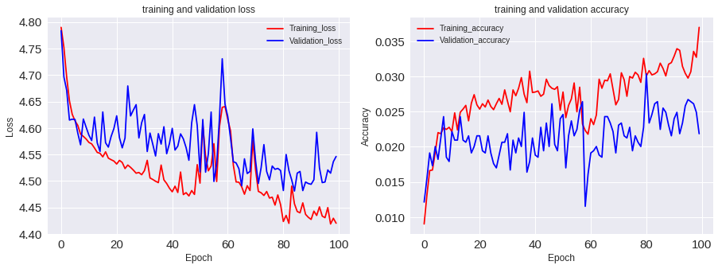

---

title: NN 100 Model
notebook: NN_100.ipynb
nav_include: 3

---

## NN 100 EDA


```python
#Libraries 
#!pip install imageio
import sys
import os
import shutil
import numpy as np
import matplotlib.pyplot as plt
import pandas as pd
from google.colab import drive
from keras.models import Sequential
from keras.layers import Dense,Activation,Dropout
from keras.layers.normalization import BatchNormalization

```


    Using TensorFlow backend.


```python

drive.mount('/content/gdrive')

```


    Drive already mounted at /content/gdrive; to attempt to forcibly remount, call drive.mount("/content/gdrive", force_remount=True).


```python
Xtrain=np.load('gdrive/My Drive/Colab Notebooks/X_train_64.npy')
Xtest=np.load('gdrive/My Drive/Colab Notebooks/X_test_64.npy')
ytrain=np.load('gdrive/My Drive/Colab Notebooks/y_train_64.npy')
ytest=np.load('gdrive/My Drive/Colab Notebooks/y_test_64.npy')
```


```python
X_train = Xtrain.reshape(Xtrain.shape[0],-1)
X_test = Xtest.reshape(Xtest.shape[0],-1)
```


```python
epochs = 100
num_hidden1 =100
num_hidden2 =100
num_hidden3 =100
num_hidden4 =100
num_hidden5 =100
num_hidden6 =100
num_hidden7 =100
num_hidden8 =100
num_hidden9 =100
num_hidden10 =100
drop_out=0.1

inputsize=X_train.shape[1]


model = Sequential()

model.add(Dense(num_hidden1, input_dim=inputsize))
#model.add(BatchNormalization())
model.add(Activation('relu'))
model.add(Dropout(drop_out))

model.add(Dense(num_hidden2))
#model.add(BatchNormalization())
model.add(Activation('relu'))
model.add(Dropout(drop_out))

model.add(Dense(num_hidden3))
#model.add(BatchNormalization())
model.add(Activation('relu'))
model.add(Dropout(drop_out))

model.add(Dense(num_hidden4))
#model.add(BatchNormalization())
model.add(Activation('relu'))
model.add(Dropout(drop_out))

model.add(Dense(num_hidden5))
#model.add(BatchNormalization())
model.add(Activation('relu'))
model.add(Dropout(drop_out))

model.add(Dense(num_hidden6))
#model.add(BatchNormalization())
model.add(Activation('relu'))
model.add(Dropout(drop_out))

model.add(Dense(num_hidden7))
#model.add(BatchNormalization())
model.add(Activation('relu'))
model.add(Dropout(drop_out))

model.add(Dense(num_hidden8))
#model.add(BatchNormalization())
model.add(Activation('relu'))
model.add(Dropout(drop_out))

model.add(Dense(num_hidden9))
#model.add(BatchNormalization())
model.add(Activation('relu'))
model.add(Dropout(drop_out))

model.add(Dense(num_hidden10))
#model.add(BatchNormalization())
model.add(Activation('relu'))
model.add(Dropout(drop_out))

model.add(Dense(120, activation = 'softmax')) 

model.compile(loss='categorical_crossentropy',optimizer='adam', metrics=['accuracy'])
model_history = model.fit(X_train, ytrain, epochs=epochs, batch_size=64, validation_split=0.2)
```


    Train on 13171 samples, validate on 3293 samples
    Epoch 1/100
    13171/13171 [==============================] - 5s 390us/step - loss: 4.7900 - acc: 0.0090 - val_loss: 4.7837 - val_acc: 0.0121
    Epoch 2/100
    13171/13171 [==============================] - 4s 303us/step - loss: 4.7523 - acc: 0.0131 - val_loss: 4.6966 - val_acc: 0.0155
    Epoch 3/100
    13171/13171 [==============================] - 4s 303us/step - loss: 4.6962 - acc: 0.0166 - val_loss: 4.6714 - val_acc: 0.0191
    Epoch 4/100
    13171/13171 [==============================] - 4s 304us/step - loss: 4.6513 - acc: 0.0167 - val_loss: 4.6150 - val_acc: 0.0173
    Epoch 5/100
    13171/13171 [==============================] - 4s 303us/step - loss: 4.6258 - acc: 0.0192 - val_loss: 4.6166 - val_acc: 0.0200
    Epoch 6/100
    13171/13171 [==============================] - 4s 303us/step - loss: 4.6135 - acc: 0.0220 - val_loss: 4.6161 - val_acc: 0.0182
    Epoch 7/100
    13171/13171 [==============================] - 4s 300us/step - loss: 4.6050 - acc: 0.0219 - val_loss: 4.5903 - val_acc: 0.0213
    Epoch 8/100
    13171/13171 [==============================] - 4s 303us/step - loss: 4.5884 - acc: 0.0227 - val_loss: 4.5682 - val_acc: 0.0243
    Epoch 9/100
    13171/13171 [==============================] - 4s 303us/step - loss: 4.5842 - acc: 0.0225 - val_loss: 4.6170 - val_acc: 0.0185
    Epoch 10/100
    13171/13171 [==============================] - 4s 302us/step - loss: 4.5792 - acc: 0.0228 - val_loss: 4.6015 - val_acc: 0.0179
    Epoch 11/100
    13171/13171 [==============================] - 4s 305us/step - loss: 4.5728 - acc: 0.0222 - val_loss: 4.5865 - val_acc: 0.0222
    Epoch 12/100
    13171/13171 [==============================] - 4s 307us/step - loss: 4.5700 - acc: 0.0248 - val_loss: 4.5763 - val_acc: 0.0210
    Epoch 13/100
    13171/13171 [==============================] - 4s 304us/step - loss: 4.5624 - acc: 0.0224 - val_loss: 4.6206 - val_acc: 0.0210
    Epoch 14/100
    13171/13171 [==============================] - 4s 302us/step - loss: 4.5540 - acc: 0.0249 - val_loss: 4.5720 - val_acc: 0.0243
    Epoch 15/100
    13171/13171 [==============================] - 4s 301us/step - loss: 4.5522 - acc: 0.0254 - val_loss: 4.5557 - val_acc: 0.0210
    Epoch 16/100
    13171/13171 [==============================] - 4s 302us/step - loss: 4.5455 - acc: 0.0259 - val_loss: 4.6303 - val_acc: 0.0206
    Epoch 17/100
    13171/13171 [==============================] - 4s 302us/step - loss: 4.5550 - acc: 0.0237 - val_loss: 4.5721 - val_acc: 0.0216
    Epoch 18/100
    13171/13171 [==============================] - 4s 303us/step - loss: 4.5431 - acc: 0.0262 - val_loss: 4.5639 - val_acc: 0.0191
    Epoch 19/100
    13171/13171 [==============================] - 4s 303us/step - loss: 4.5402 - acc: 0.0274 - val_loss: 4.5840 - val_acc: 0.0200
    Epoch 20/100
    13171/13171 [==============================] - 4s 302us/step - loss: 4.5376 - acc: 0.0260 - val_loss: 4.5990 - val_acc: 0.0216
    Epoch 21/100
    13171/13171 [==============================] - 4s 302us/step - loss: 4.5320 - acc: 0.0254 - val_loss: 4.6230 - val_acc: 0.0216
    Epoch 22/100
    13171/13171 [==============================] - 4s 301us/step - loss: 4.5389 - acc: 0.0261 - val_loss: 4.5818 - val_acc: 0.0194
    Epoch 23/100
    13171/13171 [==============================] - 4s 305us/step - loss: 4.5349 - acc: 0.0257 - val_loss: 4.5625 - val_acc: 0.0191
    Epoch 24/100
    13171/13171 [==============================] - 4s 304us/step - loss: 4.5235 - acc: 0.0266 - val_loss: 4.5809 - val_acc: 0.0216
    Epoch 25/100
    13171/13171 [==============================] - 4s 303us/step - loss: 4.5300 - acc: 0.0257 - val_loss: 4.6795 - val_acc: 0.0191
    Epoch 26/100
    13171/13171 [==============================] - 4s 304us/step - loss: 4.5257 - acc: 0.0253 - val_loss: 4.6227 - val_acc: 0.0176
    Epoch 27/100
    13171/13171 [==============================] - 4s 303us/step - loss: 4.5205 - acc: 0.0261 - val_loss: 4.6338 - val_acc: 0.0170
    Epoch 28/100
    13171/13171 [==============================] - 4s 301us/step - loss: 4.5147 - acc: 0.0269 - val_loss: 4.6441 - val_acc: 0.0188
    Epoch 29/100
    13171/13171 [==============================] - 4s 302us/step - loss: 4.5160 - acc: 0.0260 - val_loss: 4.5812 - val_acc: 0.0206
    Epoch 30/100
    13171/13171 [==============================] - 4s 301us/step - loss: 4.5118 - acc: 0.0281 - val_loss: 4.6102 - val_acc: 0.0206
    Epoch 31/100
    13171/13171 [==============================] - 4s 300us/step - loss: 4.5196 - acc: 0.0265 - val_loss: 4.6256 - val_acc: 0.0219
    Epoch 32/100
    13171/13171 [==============================] - 4s 303us/step - loss: 4.5390 - acc: 0.0250 - val_loss: 4.5555 - val_acc: 0.0167
    Epoch 33/100
    13171/13171 [==============================] - 4s 303us/step - loss: 4.5057 - acc: 0.0281 - val_loss: 4.5905 - val_acc: 0.0210
    Epoch 34/100
    13171/13171 [==============================] - 4s 302us/step - loss: 4.5028 - acc: 0.0273 - val_loss: 4.5693 - val_acc: 0.0191
    Epoch 35/100
    13171/13171 [==============================] - 4s 301us/step - loss: 4.4995 - acc: 0.0283 - val_loss: 4.5471 - val_acc: 0.0213
    Epoch 36/100
    13171/13171 [==============================] - 4s 303us/step - loss: 4.4968 - acc: 0.0298 - val_loss: 4.5893 - val_acc: 0.0200
    Epoch 37/100
    13171/13171 [==============================] - 4s 303us/step - loss: 4.5301 - acc: 0.0275 - val_loss: 4.5696 - val_acc: 0.0249
    Epoch 38/100
    13171/13171 [==============================] - 4s 303us/step - loss: 4.5021 - acc: 0.0263 - val_loss: 4.6024 - val_acc: 0.0164
    Epoch 39/100
    13171/13171 [==============================] - 4s 306us/step - loss: 4.4952 - acc: 0.0307 - val_loss: 4.5514 - val_acc: 0.0179
    Epoch 40/100
    13171/13171 [==============================] - 4s 302us/step - loss: 4.4863 - acc: 0.0277 - val_loss: 4.5708 - val_acc: 0.0213
    Epoch 41/100
    13171/13171 [==============================] - 4s 339us/step - loss: 4.4795 - acc: 0.0278 - val_loss: 4.5994 - val_acc: 0.0188
    Epoch 42/100
    13171/13171 [==============================] - 5s 363us/step - loss: 4.4901 - acc: 0.0279 - val_loss: 4.5583 - val_acc: 0.0185
    Epoch 43/100
    13171/13171 [==============================] - 4s 304us/step - loss: 4.4782 - acc: 0.0272 - val_loss: 4.5657 - val_acc: 0.0228
    Epoch 44/100
    13171/13171 [==============================] - 4s 305us/step - loss: 4.5169 - acc: 0.0275 - val_loss: 4.5890 - val_acc: 0.0194
    Epoch 45/100
    13171/13171 [==============================] - 4s 302us/step - loss: 4.4743 - acc: 0.0296 - val_loss: 4.5794 - val_acc: 0.0234
    Epoch 46/100
    13171/13171 [==============================] - 4s 301us/step - loss: 4.4779 - acc: 0.0287 - val_loss: 4.5628 - val_acc: 0.0200
    Epoch 47/100
    13171/13171 [==============================] - 4s 302us/step - loss: 4.4717 - acc: 0.0283 - val_loss: 4.5391 - val_acc: 0.0261
    Epoch 48/100
    13171/13171 [==============================] - 4s 303us/step - loss: 4.4819 - acc: 0.0282 - val_loss: 4.6098 - val_acc: 0.0203
    Epoch 49/100
    13171/13171 [==============================] - 4s 303us/step - loss: 4.4746 - acc: 0.0285 - val_loss: 4.6441 - val_acc: 0.0194
    Epoch 50/100
    13171/13171 [==============================] - 4s 302us/step - loss: 4.5309 - acc: 0.0252 - val_loss: 4.6045 - val_acc: 0.0240
    Epoch 51/100
    13171/13171 [==============================] - 4s 304us/step - loss: 4.4959 - acc: 0.0278 - val_loss: 4.5170 - val_acc: 0.0246
    Epoch 52/100
    13171/13171 [==============================] - 4s 305us/step - loss: 4.6068 - acc: 0.0241 - val_loss: 4.6160 - val_acc: 0.0170
    Epoch 53/100
    13171/13171 [==============================] - 4s 303us/step - loss: 4.5476 - acc: 0.0259 - val_loss: 4.5166 - val_acc: 0.0216
    Epoch 54/100
    13171/13171 [==============================] - 4s 306us/step - loss: 4.5191 - acc: 0.0268 - val_loss: 4.5513 - val_acc: 0.0237
    Epoch 55/100
    13171/13171 [==============================] - 4s 304us/step - loss: 4.5284 - acc: 0.0291 - val_loss: 4.6301 - val_acc: 0.0216
    Epoch 56/100
    13171/13171 [==============================] - 4s 303us/step - loss: 4.5705 - acc: 0.0250 - val_loss: 4.4991 - val_acc: 0.0225
    Epoch 57/100
    13171/13171 [==============================] - 4s 304us/step - loss: 4.4989 - acc: 0.0285 - val_loss: 4.5322 - val_acc: 0.0252
    Epoch 58/100
    13171/13171 [==============================] - 4s 306us/step - loss: 4.6024 - acc: 0.0232 - val_loss: 4.6188 - val_acc: 0.0264
    Epoch 59/100
    13171/13171 [==============================] - 4s 303us/step - loss: 4.6390 - acc: 0.0223 - val_loss: 4.7307 - val_acc: 0.0115
    Epoch 60/100
    13171/13171 [==============================] - 4s 303us/step - loss: 4.6405 - acc: 0.0218 - val_loss: 4.6450 - val_acc: 0.0161
    Epoch 61/100
    13171/13171 [==============================] - 4s 301us/step - loss: 4.6161 - acc: 0.0240 - val_loss: 4.6215 - val_acc: 0.0191
    Epoch 62/100
    13171/13171 [==============================] - 4s 301us/step - loss: 4.5945 - acc: 0.0232 - val_loss: 4.5806 - val_acc: 0.0194
    Epoch 63/100
    13171/13171 [==============================] - 4s 302us/step - loss: 4.5297 - acc: 0.0245 - val_loss: 4.5365 - val_acc: 0.0200
    Epoch 64/100
    13171/13171 [==============================] - 4s 301us/step - loss: 4.4981 - acc: 0.0296 - val_loss: 4.5340 - val_acc: 0.0188
    Epoch 65/100
    13171/13171 [==============================] - 4s 303us/step - loss: 4.4977 - acc: 0.0283 - val_loss: 4.5232 - val_acc: 0.0185
    Epoch 66/100
    13171/13171 [==============================] - 4s 303us/step - loss: 4.4890 - acc: 0.0295 - val_loss: 4.4908 - val_acc: 0.0243
    Epoch 67/100
    13171/13171 [==============================] - 4s 303us/step - loss: 4.4750 - acc: 0.0294 - val_loss: 4.5418 - val_acc: 0.0243
    Epoch 68/100
    13171/13171 [==============================] - 4s 305us/step - loss: 4.4911 - acc: 0.0304 - val_loss: 4.5141 - val_acc: 0.0234
    Epoch 69/100
    13171/13171 [==============================] - 4s 307us/step - loss: 4.4820 - acc: 0.0282 - val_loss: 4.5179 - val_acc: 0.0222
    Epoch 70/100
    13171/13171 [==============================] - 4s 303us/step - loss: 4.5770 - acc: 0.0260 - val_loss: 4.5984 - val_acc: 0.0191
    Epoch 71/100
    13171/13171 [==============================] - 4s 302us/step - loss: 4.5211 - acc: 0.0267 - val_loss: 4.5381 - val_acc: 0.0231
    Epoch 72/100
    13171/13171 [==============================] - 4s 303us/step - loss: 4.4804 - acc: 0.0305 - val_loss: 4.4952 - val_acc: 0.0234
    Epoch 73/100
    13171/13171 [==============================] - 4s 306us/step - loss: 4.4777 - acc: 0.0295 - val_loss: 4.5250 - val_acc: 0.0216
    Epoch 74/100
    13171/13171 [==============================] - 5s 361us/step - loss: 4.4726 - acc: 0.0272 - val_loss: 4.5687 - val_acc: 0.0213
    Epoch 75/100
    13171/13171 [==============================] - 5s 365us/step - loss: 4.4801 - acc: 0.0300 - val_loss: 4.5179 - val_acc: 0.0228
    Epoch 76/100
    13171/13171 [==============================] - 4s 306us/step - loss: 4.4677 - acc: 0.0298 - val_loss: 4.5022 - val_acc: 0.0194
    Epoch 77/100
    13171/13171 [==============================] - 4s 304us/step - loss: 4.4694 - acc: 0.0306 - val_loss: 4.5282 - val_acc: 0.0216
    Epoch 78/100
    13171/13171 [==============================] - 4s 303us/step - loss: 4.4545 - acc: 0.0302 - val_loss: 4.5220 - val_acc: 0.0206
    Epoch 79/100
    13171/13171 [==============================] - 5s 408us/step - loss: 4.4737 - acc: 0.0292 - val_loss: 4.5237 - val_acc: 0.0200
    Epoch 80/100
    13171/13171 [==============================] - 4s 302us/step - loss: 4.4554 - acc: 0.0326 - val_loss: 4.5198 - val_acc: 0.0228
    Epoch 81/100
    13171/13171 [==============================] - 4s 302us/step - loss: 4.4234 - acc: 0.0301 - val_loss: 4.4819 - val_acc: 0.0304
    Epoch 82/100
    13171/13171 [==============================] - 4s 303us/step - loss: 4.4351 - acc: 0.0308 - val_loss: 4.5500 - val_acc: 0.0234
    Epoch 83/100
    13171/13171 [==============================] - 6s 438us/step - loss: 4.4200 - acc: 0.0302 - val_loss: 4.5197 - val_acc: 0.0246
    Epoch 84/100
    13171/13171 [==============================] - 6s 422us/step - loss: 4.4904 - acc: 0.0304 - val_loss: 4.5020 - val_acc: 0.0261
    Epoch 85/100
    13171/13171 [==============================] - 7s 502us/step - loss: 4.4568 - acc: 0.0307 - val_loss: 4.4809 - val_acc: 0.0264
    Epoch 86/100
    13171/13171 [==============================] - 7s 549us/step - loss: 4.4424 - acc: 0.0319 - val_loss: 4.5148 - val_acc: 0.0225
    Epoch 87/100
    13171/13171 [==============================] - 7s 561us/step - loss: 4.4399 - acc: 0.0311 - val_loss: 4.5180 - val_acc: 0.0255
    Epoch 88/100
    13171/13171 [==============================] - 7s 561us/step - loss: 4.4587 - acc: 0.0301 - val_loss: 4.4818 - val_acc: 0.0249
    Epoch 89/100
    13171/13171 [==============================] - 7s 563us/step - loss: 4.4370 - acc: 0.0317 - val_loss: 4.4981 - val_acc: 0.0231
    Epoch 90/100
    13171/13171 [==============================] - 8s 570us/step - loss: 4.4313 - acc: 0.0320 - val_loss: 4.4951 - val_acc: 0.0216
    Epoch 91/100
    13171/13171 [==============================] - 7s 560us/step - loss: 4.4274 - acc: 0.0329 - val_loss: 4.4937 - val_acc: 0.0240
    Epoch 92/100
    13171/13171 [==============================] - 7s 552us/step - loss: 4.4430 - acc: 0.0339 - val_loss: 4.5023 - val_acc: 0.0249
    Epoch 93/100
    13171/13171 [==============================] - 8s 576us/step - loss: 4.4348 - acc: 0.0337 - val_loss: 4.5919 - val_acc: 0.0219
    Epoch 94/100
    13171/13171 [==============================] - 6s 439us/step - loss: 4.4511 - acc: 0.0314 - val_loss: 4.5247 - val_acc: 0.0234
    Epoch 95/100
    13171/13171 [==============================] - 4s 329us/step - loss: 4.4337 - acc: 0.0304 - val_loss: 4.4969 - val_acc: 0.0258
    Epoch 96/100
    13171/13171 [==============================] - 5s 347us/step - loss: 4.4307 - acc: 0.0298 - val_loss: 4.4981 - val_acc: 0.0267
    Epoch 97/100
    13171/13171 [==============================] - 4s 294us/step - loss: 4.4497 - acc: 0.0307 - val_loss: 4.5208 - val_acc: 0.0264
    Epoch 98/100
    13171/13171 [==============================] - 4s 294us/step - loss: 4.4188 - acc: 0.0336 - val_loss: 4.5147 - val_acc: 0.0261
    Epoch 99/100
    13171/13171 [==============================] - 4s 294us/step - loss: 4.4296 - acc: 0.0327 - val_loss: 4.5364 - val_acc: 0.0249
    Epoch 100/100
    13171/13171 [==============================] - 4s 293us/step - loss: 4.4203 - acc: 0.0370 - val_loss: 4.5462 - val_acc: 0.0219


```python
def get_plots(model):
    fig, (ax1,ax2) = plt.subplots(1, 2, figsize=(15,5))
    ax1.plot((model.history['loss']), 'r', label='Training_loss')
    ax1.plot((model.history['val_loss']), 'b' ,label='Validation_loss')
    ax1.set_xlabel(r'Epoch', fontsize=12)
    ax1.set_ylabel(r'Loss', fontsize=12)
    ax1.legend()
    ax1.set_title("training and validation loss")
    ax1.tick_params(labelsize=15)


    ax2.plot(model.history['acc'], 'r', label='Training_accuracy')
    ax2.plot(model.history['val_acc'], 'b' ,label='Validation_accuracy')
    ax2.set_xlabel(r'Epoch', fontsize=12)
    ax2.set_ylabel(r'Accuracy', fontsize=12)
    ax2.legend()
    ax2.set_title("training and validation accuracy")
    ax2.tick_params(labelsize=15)

get_plots(model_history)
```





```python
scores = model.evaluate(Xtest.reshape(Xtest.shape[0],-1), ytest, verbose=0)
print(" The test accuracy is {}".format(scores[1]*100))
```


     The test accuracy is 2.0894071914480077

